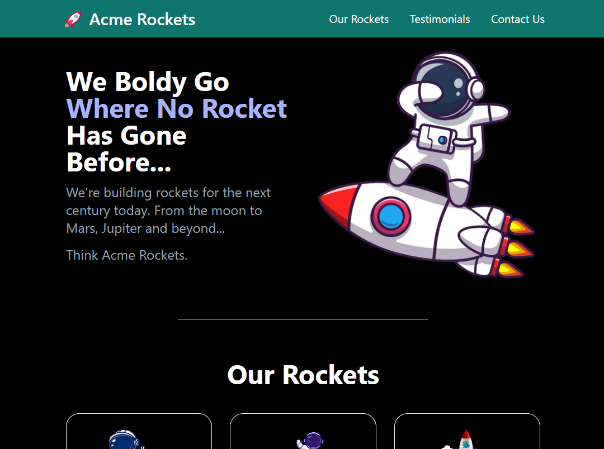

# Acme Rockets

## Description

Acme Rockets is a project that aims to create a simple single-page website using HTML, CSS, JavaScript, and the Tailwind CSS styling framework.

This project was developed with the main objective of learning and practicing the use of the utility classes provided by Tailwind CSS, a highly modular and flexible CSS styling framework.

## Technologies

- HTML
- CSS
- JavaScript
- Tailwind CSS
- NPM
- Prettier

## Installation Instructions

### Prerequisites

- Node.js installed on your machine
- NPM (usually comes installed with Node.js)

### Steps

1. Clone this repository to your local machine.
2. Navigate to the project directory.
3. Run the command `npm install` to install all the necessary dependencies.
4. Run the command `npm run build:css` to compile the Tailwind CSS assets.
5. Open the `index.html` file in your browser to view the website.

## How to Use

Acme Rockets is a simple single-page website that can be customized and styled according to your needs. You can edit the HTML, CSS, and JavaScript files to adapt the content and appearance of the website.

Tailwind CSS is used to style the website elements in a modular and efficient way. The utility classes provided by Tailwind CSS allow you to apply styles quickly, without the need to write custom CSS.

## License

This project is licensed under the [MIT License](LICENSE.md).